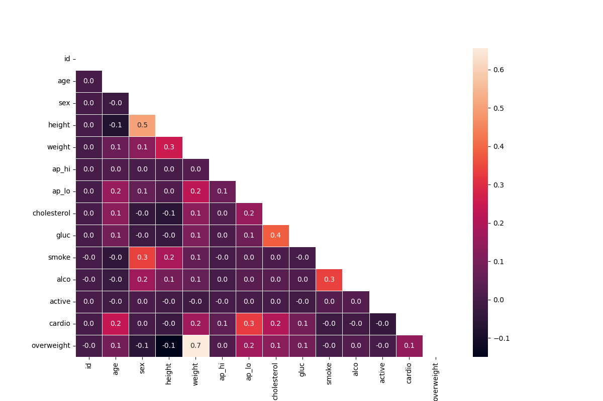

# Medical Data Visualizer

This project is a solution to the "Medical Data Visualizer" challenge, the third project in the **freeCodeCamp Data Analysis with Python** certification.

## Project Description

The goal of this programme is to visualise and make calculations from medical examination data using **matplotlib**, **seaborn**, and **pandas**. The dataset explores the relationship between cardiac disease, body measurements, blood markers, and lifestyle choices.

The script performs data cleaning, calculates Body Mass Index (BMI) to determine overweight status, normalises data, and generates two specific visualisations:
1.  **Categorical Plot:** A bar chart showing the counts of good and bad outcomes for various categorical features, split by cardiovascular disease status.
2.  **Heat Map:** A correlation matrix comparing all features in the dataset.

## Dataset

The project utilises the `medical_examination.csv` file. The dataset contains the following features:

| Feature | Variable Type | Variable | Value Type |
| --- | --- | --- | --- |
| Age | Objective Feature | `age` | int (days) |
| Height | Objective Feature | `height` | int (cm) |
| Weight | Objective Feature | `weight` | float (kg) |
| Gender | Objective Feature | `sex` | categorical code |
| Systolic blood pressure | Examination Feature | `ap_hi` | int |
| Diastolic blood pressure | Examination Feature | `ap_lo` | int |
| Cholesterol | Examination Feature | `cholesterol` | 1: normal, 2: above normal, 3: well above normal |
| Glucose | Examination Feature | `gluc` | 1: normal, 2: above normal, 3: well above normal |
| Smoking | Subjective Feature | `smoke` | binary |
| Alcohol intake | Subjective Feature | `alco` | binary |
| Physical activity | Subjective Feature | `active` | binary |
| Presence or absence of cardiovascular disease | Target Variable | `cardio` | binary |

## Implementation Details

### Data Pre-processing
Upon loading, the script performs the following operations:
1.  **Overweight Calculation:** Adds an `overweight` column. This is calculated by dividing weight (kg) by the square of height (m). If the result is > 25, the value is `1`, otherwise `0`.
2.  **Normalisation:** The `cholesterol` and `gluc` (glucose) columns are normalised to binary values:
    * `0`: Normal (originally 1)
    * `1`: Bad (originally > 1)

### Visualisation Functions

#### `draw_cat_plot()`
1.  **Melting:** Converts the data into long format using `pd.melt`, keeping `cardio` as the identifier and selecting `cholesterol`, `gluc`, `smoke`, `alco`, `active`, and `overweight` as value variables.
2.  **Grouping:** Groups the data by `cardio`, `variable`, and `value` to calculate the total counts for each category.
3.  **Plotting:** Uses `sns.catplot` (kind='bar') to draw a categorical plot, separating the data by `cardio` status.
4.  **Output:** Saves the figure as `catplot.png`.

#### Categorical Plot


#### `draw_heat_map()`
1.  **Data Cleaning:** Filters the dataframe to remove incorrect data segments:
    * Diastolic pressure (`ap_lo`) is higher than systolic (`ap_hi`).
    * Height is less than the 2.5th percentile or more than the 97.5th percentile.
    * Weight is less than the 2.5th percentile or more than the 97.5th percentile.
2.  **Correlation:** Calculates the correlation matrix using `.corr()`.
3.  **Masking:** Generates a mask for the upper triangle using `np.triu` to avoid redundant information in the heatmap.
4.  **Plotting:** Uses `sns.heatmap` to plot the correlation matrix with annotations formatted to 1 decimal place.
5.  **Output:** Saves the figure as `heatmap.png`.

#### Heat Map


## Technologies Used

-   **Python 3**
-   **Pandas**
-   **Matplotlib**
-   **Seaborn**
-   **Numpy**

## Installation

1.  Clone the repository:
    ```bash
    git clone https://github.com/sahmed0/medical-data-visualiser.git
    ```
2.  Navigate to the directory:
    ```bash
    cd medical-data-visualiser
    ```
3.  Install the required dependencies:
    ```bash
    pip install pandas matplotlib seaborn numpy
    ```

## Usage

Ensure `medical_examination.csv` is in the working directory. Import the module and call the visualisation functions.

```python
import medical_data_visualiser

# Generate and save the Categorical Plot
medical_data_visualiser.draw_cat_plot()

# Generate and save the Heat Map
medical_data_visualizer.draw_heat_map()


