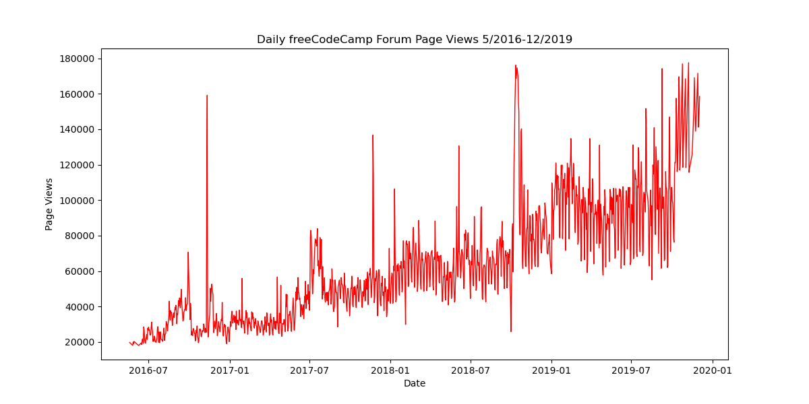

# Page View Time Series Visualizer

This project is the solution to the "Page View Time Series Visualizer" challenge, the fourth project in the **freeCodeCamp Data Analysis with Python** certification.

## Project Description

The goal of this project is to visualise time-series data using line charts, bar charts, and box plots. The dataset contains the number of page views each day on the freeCodeCamp.org forum from 2016 to 2019.

The visualisations help identify patterns in the data, including:
1.  **Trends:** How page views change year-over-year.
2.  **Seasonality:** How page views change month-over-month.

## Dataset

The project utilises the `fcc-forum-pageviews.csv` file.
* **Index:** Date (daily)
* **Column:** `value` (Page views)

## Implementation Details

### Data Cleaning
Before plotting, the data is cleaned to remove noise and outliers. We filter out days when page views were in the top or bottom 2.5% of the dataset.

### Visualisation Functions

#### 1. Line Plot (`draw_line_plot`)
* **Library:** Matplotlib
* **Description:** Draws a line chart showing daily page views from May 2016 to December 2019.
* **Style:** Red line (`color='r'`).
* **Output:** Saved as `line_plot.png`.



#### 2. Bar Plot (`draw_bar_plot`)
* **Library:** Pandas Plotting (Matplotlib wrapper)
* **Description:** Draws a bar chart showing the *average* daily page views for each month, grouped by year.
* **Details:** The legend differentiates the months (January through December).
* **Output:** Saved as `bar_plot.png`.


#### 3. Box Plots (`draw_box_plot`)
* **Library:** Seaborn
* **Description:** Generates two adjacent box plots to visualise distribution:
    * **Year-wise (Trend):** Shows how the range and median of page views change year by year.
    * **Month-wise (Seasonality):** Shows the distribution of page views for each month across all years to identify seasonal spikes.
* **Output:** Saved as `box_plot.png`.


## Technologies Used

-   **Python 3**
-   **Pandas** (Data manipulation and plotting)
-   **Matplotlib** (Base plotting library)
-   **Seaborn** (Advanced statistical plotting)

## Installation

1.  Clone the repository:
    ```bash
    git clone https://github.com/sahmed0/time-series-visualiser.git
    ```
2.  Navigate to the directory:
    ```bash
    cd time-series-visualiser
    ```
3.  Install the required dependencies:
    ```bash
    pip install pandas matplotlib seaborn
    ```

## Usage

Ensure `fcc-forum-pageviews.csv` is in the working directory. Import the module and call the visualisation functions.

```python
import time-series-visualiser

# Generate and save the Line Plot
time-series-visualiser.draw_line_plot()

# Generate and save the Bar Plot
time-series-visualiser.draw_bar_plot()

# Generate and save the Box Plots
time-series-visualiser.draw_box_plot()

